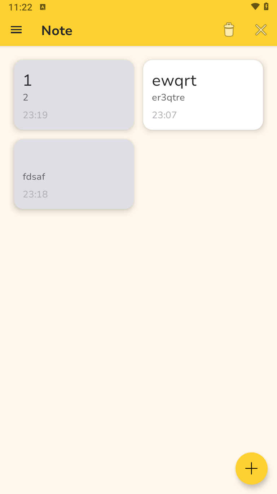
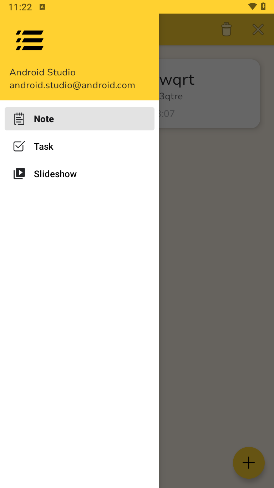
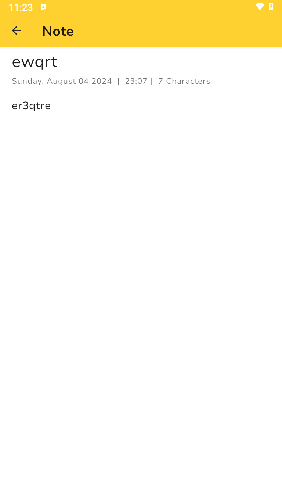

# BAZZ List

## Description

BAZZ List is a simple and intuitive Android application for managing your notes efficiently. It
features a clean user interface with support for adding, editing, and deleting notes. The app uses a
Room database to store notes and provides a smooth user experience with multi-selection
capabilities.

## Features

- **Add Notes:** Easily create new notes with a user-friendly editor.
- **Edit Notes:** Modify existing notes with a simple interface.
- **Delete Notes:** Remove unwanted notes with ease.
- **Multi-Selection Mode:** Long-press to select multiple notes and perform batch operations.
- **Navigation:** Smooth transitions between different views and activities.

## Screenshots

### Main Screen


*Main screen with list of notes*

### Navigation


*Navigate between pages*

### Note Editor


*Note editor for creating and modifying notes*

## Getting Started

To run BAZZ List on your local machine, follow these steps:

1. **Clone the repository:**
   ```bash
   git clone https://github.com/waffiqaziz/BAZZ-List.git
2. Open the project in Android Studio.

3. Build the project:

- Go to Build > Make Project or use the shortcut Ctrl+F9.

1. Run the app:

- Connect an Android device or start an emulator.
- Click on the Run button or use the shortcut Shift+F10.

## Dependencies

- Kotlin
- Android Jetpack Library (Room, Navigation Component)
- RecyclerView
- CardView
- [AztecEditor](https://github.com/wordpress-mobile/AztecEditor-Android) - Licensed under [Mozilla Public License 2.0](http://mozilla.org/MPL/2.0/)

## Contributing

If you want to contribute to the development of BAZZ List, please follow these steps:

1. Fork the repository.
2. Create a feature branch ```git checkout -b feature/YourFeature```.
3. Commit your changes ```git commit -am 'Add new feature'```.
4. Push to the branch ```git push origin feature/YourFeature```.
5. Create a new Pull Request.

## License

This project is licensed under the MIT License - see the [LICENSE](LICENSE) file for details.

### Third-Party Licenses

Please note that this project includes components that are licensed under different terms:

- The `AztecEditor` library is licensed under the [Mozilla Public License 2.0 (MPL 2.0)](http://mozilla.org/MPL/2.0/). See the `LICENSES/MPL-2.0.txt` file for more details.

*If you have any questions or suggestions, feel free to reach out.